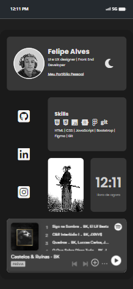

<h2>Link Bio - Bento Menu</h2>

Olá pessoal. 😁
Fiz esse <i>Link Bio</i> baseado em um conceito que vi no Tiktok.

Conceito de Ricardo Moura: <a href="https://www.tiktok.com/riicardomoura">TikTok</a>

Utilizei <code>Display: grid;</code> no CSS como forma de estudo para fazer este pequeno projeto, optei por adicionar alguns elementos que utilizam JavaScript também como forma de estudo.

